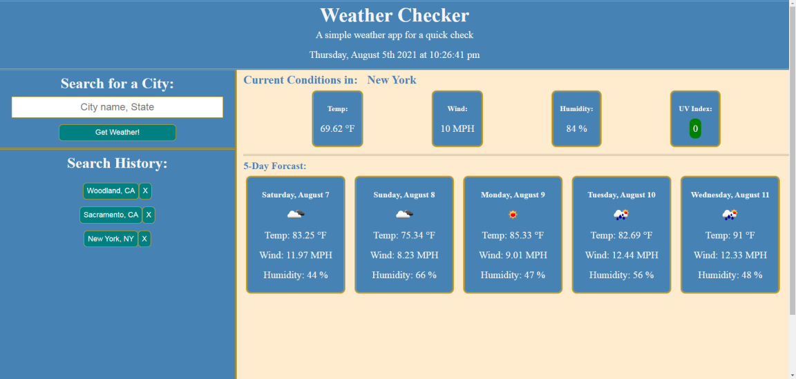

# thlanceWeather

This app recieves an input and uses the OpenWeatherMap API to geocode and pull current and 5 day forcast for a city. Input validation is minimal so query must be "City" or "City, State". Successful requests are saved to a search history, clicking the history button will re-retrieve the current weather and forcast. 

Screenshot:

URL: https://thlancegit.github.io/thlanceWeather/